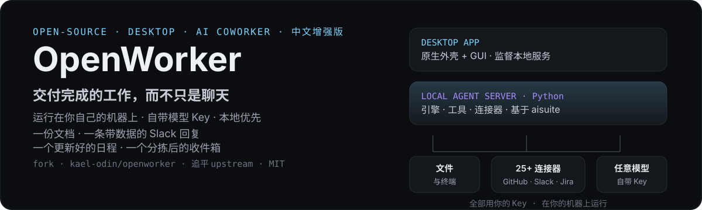

<p align="center">
  
</p>

# OpenWorker

**[openworker.com](https://openworker.com)** · [下载](#下载) · [Issues](https://github.com/andrewyng/openworker/issues)

<p align="center"><a href="https://trendshift.io/repositories/91434?utm_source=trendshift-badge&utm_medium=badge&utm_campaign=badge-trendshift-91434" target="_blank" rel="noopener noreferrer"></a></p>

> **📦 关于本仓库**：这是 [andrewyng/openworker](https://github.com/andrewyng/openworker) 的**中文增强版 fork**（`kael-odin/openworker`），**追平上游**并保持同步。在上游 i18n 之外补齐 **agent 侧中文**（persona/审批/压缩摘要/连接器目录）与 **Windows + 国内网络环境加固**，详见下文[「汉化说明」](#汉化说明)与[「能力增强说明」](#能力增强说明)。

> **Beta** — OpenWorker 处于公开测试阶段：完全可用、可自动更新，我们正在持续打磨粗糙的边角。欢迎提 [Issue](https://github.com/andrewyng/openworker/issues)。

**把日常任务真正做完的 AI。** OpenWorker 是一个开源的 AI 协作伙伴，驻留在你的桌面上，交付的是**完成的工作**而不只是聊天：一份打磨好的文档、一条带数据的 Slack 回复、一个更新好的日程、一个分拣后的收件箱。

它运行在你自己的机器上，不锁定任何模型：自带 OpenAI、Anthropic、Google 或任意开放权重模型的 API Key，或用 Ollama 完全本地运行。你的数据只有在经过*你*选择的模型与集成时才会离开你的机器。每一个 agent 动作都受治理与记录 —— 见[「治理即设计」](#治理即设计)。

[](https://openworker.com)

## 下载

[**⬇ macOS（Apple Silicon）**](https://github.com/kael-odin/openworker/releases/latest/download/OpenWorker-macos-arm64.dmg)
<sub>macOS 12+ · fork 构建未经 Apple 签名与公证，首次启动需右键打开 · 支持应用内自动更新</sub>

[**⬇ Windows 10/11（x64）**](https://github.com/kael-odin/openworker/releases/latest/download/OpenWorker-windows-setup.exe)
<sub>fork 构建未经 Authenticode 代码签名，SmartScreen 会提示 · 支持应用内自动更新</sub>

打开应用，添加一个模型 Key（或指向 Ollama），提一个真实的需求。

## 用例

选一个协作伙伴，指向真实工作，拿到做好的交付件：

- **安全审查** - 扫描代码库及其依赖的真实风险。发现来自确定性扫描器（如 semgrep）加模型推理；提出的修复会被重新扫描并经 diff 复核，批准前修复者从不是唯一检查者。
- **云态势审计** - 对照常见误配类别审计云配置，起草修复计划。
- **事件分诊** - 处理安全或运维事件：跨工具聚合上下文、起草时间线、准备报告。
- **日常工作** - 从 CRM 和收件箱准备客户通话，把散落笔记变成可落地计划，产出文档与电子表格，打理日历与 Slack 线程。
- **常驻自动化** - 早报、周报、频道常驻值守 —— 定时运行，带完整对话记录。

专业协作伙伴自带该工作的工具、工作风格与检查点。安全协作伙伴优先发布。

## 治理即设计

治理是架构，不是插件 —— agent 无法自我授予新权限，没有 prompt 能说服它绕过闸门。三层防线，全在本仓库：

1. **硬性底线**。一组危险且不可逆的操作永远仅限人工，永远。任何模式 —— 包括完全自动批准 —— 都不会降低这些底线；它们永远升级给你。
2. **逐级获得的自主权**。动作默认需审批。一次性批准可晋升为常驻规则，再晋升为配置白名单 —— 每一步都显式、可见、可撤销。自动批准模式下，审查模型放行常规动作，不确定的升级给你；连续拒绝触发熔断，暂停审查并交回控制权。审查裁决是判断，非担保 —— 底线与审计轨迹才是兜底。
3. **能回答「谁做的、为什么」的审计轨迹**。每个工具调用都记录审批溯源 —— 自动批准、用户批准、或拒绝，附带审查推理 —— 并随对话持久化。

无人值守运行永不自批：其请求停泊在收件箱等人工应答。发现漏洞？见 [SECURITY.md](SECURITY.md)。

## 能力

- **产出真实成果** —— 文档、电子表格、报告、网页，都以可直接打开和分享的文件形式落地。
- **从 Slack 触发** —— 在频道里 @`OpenWorker`；你的桌面会开启一个会话，用你的工具完成工作，再把答案作为线程回复发回去。
- **用你日常的工具** —— 25+ 集成，包括 GitHub、Slack、Jira、Notion、Linear、HubSpot、Outlook、monday.com、Gmail、Google 日历，外加你的**终端与本地文件**。任何能通过 [MCP](https://modelcontextprotocol.io/) 访问的工具也能接入，并支持按工具粒度的权限控制。
- **按计划运行** —— 面向周期性工作的自动化：晨报、周报、对一个频道的常驻值守。运行结果会带着完整对话记录进入应用。
- **行动前先请示** —— 写入、发送、shell 命令都需审批放行。无人值守的运行会把待办事项停泊到收件箱，而不是擅自动手。

## 工作原理

1. 告诉 OpenWorker 你想要的成果 ——「准备一份客户简报」「理清我的日程」「起草一份报告」「查一下发布进度在 Jira 和 GitHub 上各到哪一步」。
2. 它把任务拆解成多个步骤，在你的桌面、文件和已连接的应用之间穿行作业。
3. 在做任何有后果的事之前 —— 发送消息、改动日程、执行命令 —— 它会先征求你的意见，你来批准或调整方向。
4. 你拿到的是做好的成果，而不是一张待办清单。

底层架构：

```text
┌────────────────────────────────────────────────┐
│              OpenWorker 桌面应用               │  原生外壳 + GUI
├────────────────────────────────────────────────┤
│           本地 agent 服务（Python）            │  引擎 · 工具 · 连接器 — 基于 aisuite
├───────────────┬────────────────┬───────────────┤
│   你的文件    │    你的工具    │   你的模型    │  全部用你的 Key，
│  与终端       │  25+ 连接器    │  任意 provider │  在你的机器上运行
└───────────────┴────────────────┴───────────────┘
```

## 自带模型

模型访问权在你手里：选一个 provider，粘贴你的 Key，随时切换。开箱即支持：

**OpenAI · Anthropic · Google Gemini · BytePlus 火山方舟 · 火山方舟 Agent 计划 · Inkling（Thinking Machines）· GLM（Z.ai）· DeepSeek · Kimi（Moonshot）· 通义千问 · MiniMax · Mistral · Grok（xAI）** —— 外加通过 **Together** 和 **Fireworks** 的开放权重模型，以及通过 **Ollama** 的完全本地模型。

一个精选的模型清单标注了我们验证过可用于工具调用的型号。填入任意模型字符串也可用，风险自负。

## 隐私

OpenWorker 本地优先。一切都在你的机器上：agent 循环、你的对话、连接器 token、模型 Key —— 全部存在应用本地的 secret store 里。唯一的云端组件是一个为连接器代理 OAuth 握手的小服务。你随时可以不登录直接使用应用 —— 用手动创建的凭证/API Key 走连接器即可。

## 汉化说明

**上游已内置 GUI 中英 i18n**（react-i18next + `src/locales/`，跟随系统语言，设置页可切换），因此本 fork **不再自建前端 i18n 框架**，直接采用上游架构。fork 的汉化增量在上游覆盖不到的地方：

- **Agent 侧中文（核心增量）**：上游 i18n 只覆盖界面，agent 自己"说的话"仍是英文。本 fork 将其汉化为中文——persona 系统 prompt（`personas/builtin/*.md`，协作伙伴默认中文思考与产出）、权限决策 reason（`permissions.py`）、上下文压缩全链路（`compaction.py`：摘要 prompt、续作契约、工作状态抽取，长会话自动生成**中文**摘要）、引擎通知（模型切换/压缩失败等）、审批交互文案（批准/拒绝）。`<compacted-history>` 等协议字段保持英文。
- **连接器目录中文**：`descriptors.py` + `catalog_copy.py`，40 个 connector 的标题/说明/字段全中文。
- **GUI 补充键**：在上游 locales 之上补齐 `humanize.*`（工具调用的单行 human-readable 文案，上游设计为英文）与 transcript 通知回退串的中文，键位与占位符和上游契约测试保持对齐。
- **中文回复行为**：persona prompt 引导模型中文优先，而非机械翻译输出。

**与上游的关系**：`upstream` 追踪 `andrewyng/openworker`，`origin` 为本 fork。定期 `fetch` → `merge` → 推送，能力与上游一致。**当前已追平上游 main（2026-08-30）**。由于前端 i18n 与上游同架构，后续追平的合并成本已大幅降低。

## 能力增强说明

除汉化外，本 fork 面向「中文用户 + Windows + 本地从源码构建」场景做了增强：

- **Windows/国内网络环境加固**：
  - URL 守卫放行 `198.18.0.0/15`（Clash/surge TUN 的 fake-ip DNS 段）——上游实现下这类用户的 web_fetch 会被一律拒绝；
  - grep 修复 ripgrep 输出在 Windows 盘符路径上的解析，且排除 glob 不再误伤 `AppData` 祖先目录；
  - 工具链解析支持 PATHEXT（`gitleaks.exe` 等）；25 个仅 Windows 失败的测试全部修复（icacls GBK 编码、symlink 特权、tzset 等），Windows 下测试套件全绿。
- **发布通道**：fork 自建带签名的 release 与自动更新清单（`latest.json`），应用内自动更新走 fork releases。
- **本地构建链整理**：`scripts/` 下提供 `install_deps.sh`（一键建 `.venv` 装后端依赖）与 `tauri_dev.cmd`（Windows 编译运行桌面 app，含 MSVC/cmake/LIBCLANG_PATH 环境激活说明）。
- **文档与审查报告**：`docs/` 收纳 `AUDIT_REPORT.md`（fork 全量审计报告，中文）与 `USAGE_GUIDE.md`（从源码运行指南）。

## 从源码运行

前置条件：Python 3.10+、Node 20+，以及（桌面外壳用）通过 [rustup](https://rustup.rs/) 安装的 Rust 工具链。

```shell
git clone https://github.com/kael-odin/openworker
cd openworker

# 1. 一次性引导 —— 在 .venv 创建 Python 虚拟环境
#    （Windows 上用 Git Bash 或 WSL 运行）
bash packaging/setup_dev_env.sh

# 2. 启动本地 agent 服务
.venv/bin/openworker-server --cwd ~/some/project --port 8765
#    （Windows: .venv\Scripts\openworker-server.exe）

# 3. 在第二个终端启动 UI
cd surfaces/gui
npm install
npm run dev        # 浏览器 UI，跑在 Vite dev 端口上
```

standalone server 启动时会在 `<state-dir>/sidecar-8765.token` 生成一个仅当前用户可读的 per-launch token；Vite 启动时读取这个文件。直接调用 API 时，把它的值放进 `X-OpenWorker-Token` 头。桌面 app 则用内存里的 launch token，从不落盘。

要运行完整桌面 app 而非浏览器 UI，把第 3 步换成 `npm run tauri dev`（在 `surfaces/gui/` 下执行）—— Tauri 外壳会拉起窗口并自行监督 server。

测试：`.venv/bin/pytest`（后端），`surfaces/gui` 下 `npm test` 与 `npm run e2e`（GUI 单测 + 端到端）。桌面安装包用 `packaging/build_dmg.sh` / `packaging/build_windows.ps1` 构建。

## 仓库结构

| 目录 | 内容 |
|---|---|
| `coworker/` | Python 后端 —— agent 引擎、模型 provider、连接器、MCP 客户端、记忆、自动化 |
| `surfaces/gui/` | 桌面应用 —— React UI + 监督 server 的 Tauri 外壳 |
| `stt/` | 语音输入 sidecar（Rust） |
| `packaging/` | 安装包构建（macOS DMG、Windows）、自动更新 manifest、dev 引导 |
| `docs/` | 设计规格、决策记录、本 fork 的审计报告与使用指南 |
| `assets/readme/` | README 用的 SVG 视觉资源 |
| `tests/` | 后端测试套件 |

## 基于 aisuite

OpenWorker 的引擎构建于 [**aisuite**](https://github.com/andrewyng/aisuite) 之上 —— 一个轻量 Python 库，提供跨 LLM provider 的统一 chat-completions API，以及带工具、工具包与 MCP 支持的 agent 层。如果你想搭自己的 agent 框架而不是用我们的，从那里起步；本仓库是 aisuite 能力的一份可运行参考。

OpenWorker 最初在 aisuite 仓库内开发，后迁出独立成仓；感谢 aisuite 贡献者们打下的基础。

## 贡献

欢迎提贡献与 bug 报告 —— 开一个 [issue](https://github.com/andrewyng/openworker/issues) 或 pull request。应用会自动更新，因此修复能很快触达安装。提 PR 时请附上「坏的样子」与「修好后的样子」的截图。我们近期会放出可贡献的功能清单。
请注意我们正基于一份内部清单与目标积极开发，因此可能不会合入那些与在研功能重叠、或偏离本 fork 定位的 PR。

## 许可证

MIT —— 见 [LICENSE](LICENSE)。